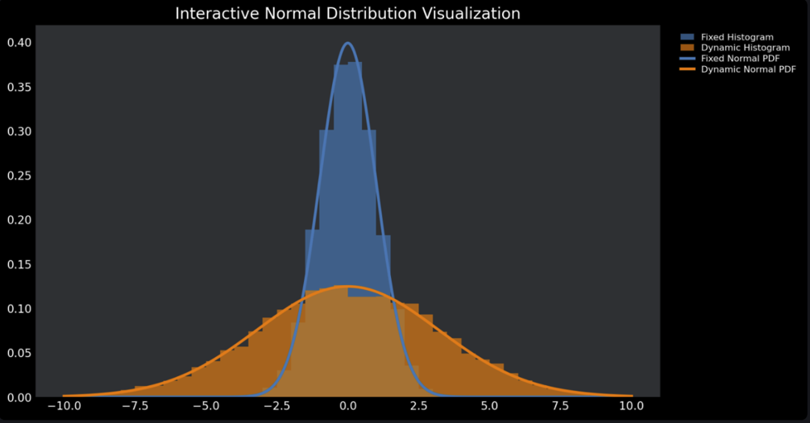
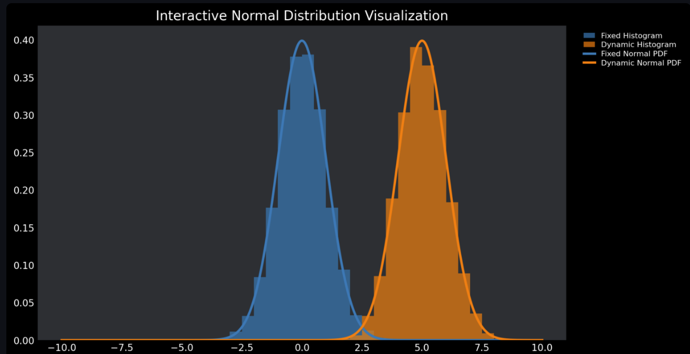
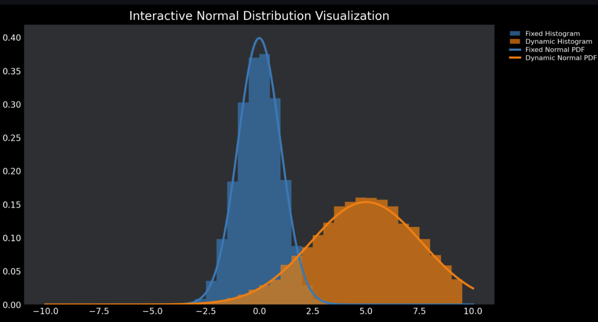

# Interactive Normal Distribution Visualization

This **Streamlit app** provides an **interactive visualization** of the **Normal Distribution**, allowing users to modify **Mean (μ) and Standard Deviation (σ)** in real-time. The app dynamically updates the **Probability Density Function (PDF) and histogram**, helping users understand how data distribution changes.

---

## Why is this Important?

Understanding **Mean (μ) and Standard Deviation (σ)** is crucial in various domains:

 **Data Science & Machine Learning** – Used in **feature scaling, anomaly detection, and probability modeling**  
 **Finance & Risk Analysis** – Helps analyze **stock price volatility and risk assessment**  
 **Healthcare & Biology** – Many biological phenomena (e.g., test results) follow a **normal distribution**  
 **Manufacturing & Quality Control** – Ensures product tolerances and defect prediction  

This tool makes it easy to **see the impact of μ and σ** in an intuitive, visual way.

---

##  Example Visualizations

### **1 Standard Normal Distribution (μ=0, σ=1)**
This is the **baseline normal distribution**, where **Mean = 0** and **Standard Deviation = 1**.

---

### **2 Effect of Increasing Standard Deviation (σ)**
Increasing **σ** makes the curve **wider and flatter**, indicating higher variance.

---

### **3 Effect of Changing Mean (μ)**
Changing **μ** shifts the curve **left or right**, without affecting its shape.

---

### **4 Changing Both Mean & Standard Deviation**
When both **μ and σ** change, the curve **shifts and reshapes**, demonstrating their combined effects.

---

